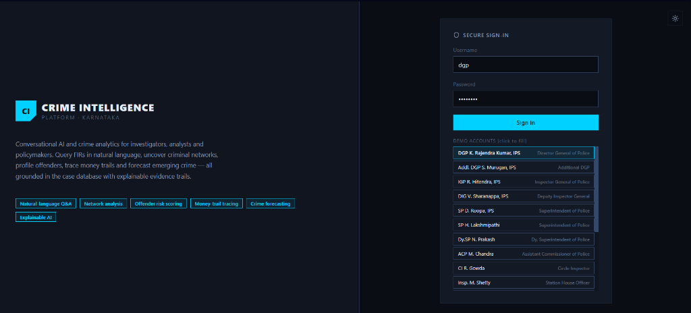
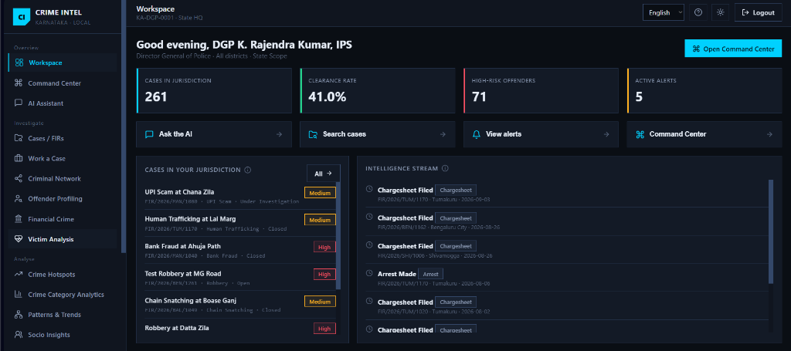
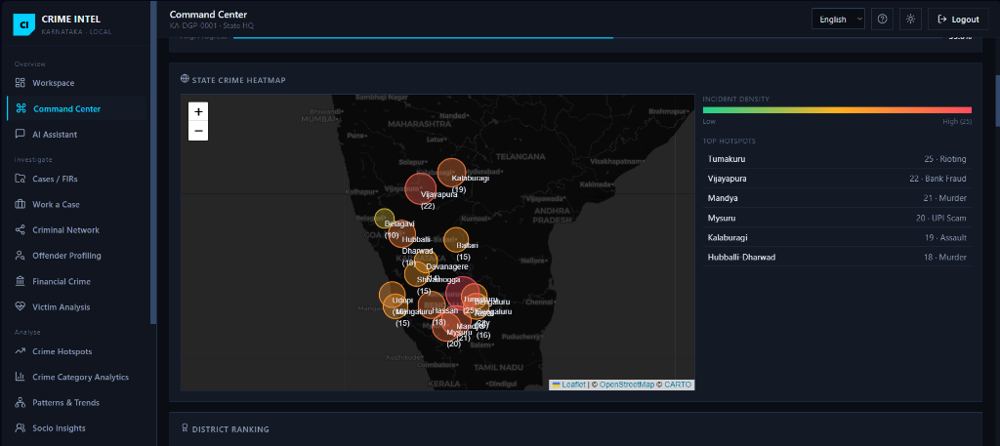
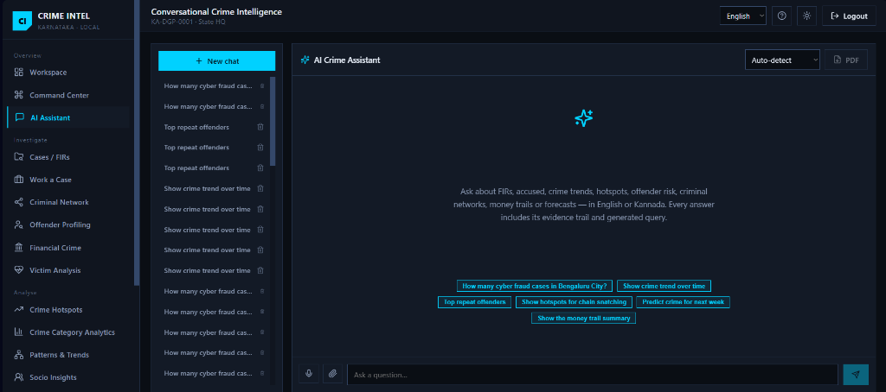
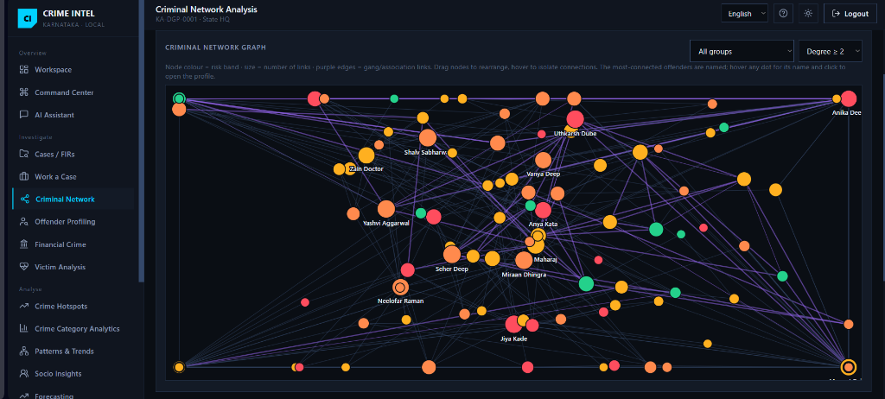

# 🛡️ Suraksha AI — Conversational Crime Intelligence Platform

[](https://github.com/legacy-000/SurakshaAI)
[](https://catalyst.zoho.in)
[](https://fastapi.tiangolo.com)
[](https://react.dev)
[](https://www.typescriptlang.org)
[](LICENSE)

> **Suraksha AI** is an enterprise-grade Conversational Crime Intelligence and Predictive Analytics Platform engineered for **Karnataka State Police (KSP Datathon 2026)**. Built on **Zoho Catalyst** and **QuickML LLM**, it converts fragmented FIRs, modus operandi data, victim records, and financial trails into real-time, evidence-grounded intelligence.

---

## 📌 Table of Contents

- [Executive Summary](#-executive-summary)
- [Key Features](#-key-features)
- [Application Showcase & Screenshots](#-application-showcase--screenshots)
- [System Architecture](#-system-architecture)
- [Role-Based Access Control (RBAC)](#-role-based-access-control-rbac)
- [Quick Start & Local Setup](#-quick-start--local-setup)
- [Zoho Catalyst Deployment Guide](#-zoho-catalyst-deployment-guide)
- [Database Schema](#-database-schema)
- [License & Acknowledgments](#-license--acknowledgments)

---

## 💡 Executive Summary

Modern law enforcement agencies collect massive volumes of crime data. However, extracting cross-district criminal intelligence, detecting modus operandi patterns, and identifying repeat offenders often requires manual query building across fragmented databases.

**Suraksha AI** solves this challenge through:
1. **Conversational AI Q&A (English & Kannada)**: Natural language queries grounded directly against the database with strict citation trails.
2. **Visual Network Graph Analysis**: Automated mapping of criminal syndicates, modus operandi matches, and shared phone/bank connections.
3. **Predictive Analytics & Forecasting**: Time-series modeling (QuickML Prophet) to predict crime surges and hotspot beats before incidents occur.
4. **Zero-Trust Governance**: Immutable cryptographic audit logging to track every user query, FIR view, and document export for legal compliance.

---

## ✨ Key Features

### 🛡️ 1. Role-Scoped Executive Dashboards
Tailored interfaces ranging from **DGP / IGP** (state & range-wide command center) to **Station House Officers (SHO)** (beat & local case management).

### 🗺️ 2. Live Command Center & State Crime Heatmap
Interactive Leaflet map overlaying district-level crime densities, top hotspot rankings (e.g., Tumakuru, Vijayapura, Mysuru), and real-time intelligence feeds.

### 🤖 3. Conversational Intelligence Engine (GLM 4.7)
Ask complex analytical questions in plain English or **Kannada** (*"ಬೆಂಗಳೂರಿನಲ್ಲಿ ಇತ್ತೀಚೆಗೆ ದಾಖಲಾದ ಸೈಬರ್ ಅಪರಾಧ ಎಫ್‌ಐಆರ್‌ಗಳನ್ನು ತೋರಿಸಿ"*). Every answer includes an evidence trail and downloadable report.

### 🕸️ 4. Criminal Network & Modus Operandi Graph
Interactive visual graph linking offenders, gang affiliations, shared bank accounts, and degree of separation filters to uncover hidden criminal syndicates.

### 💳 5. Financial Crime & Money Trail Analysis
Visual bank transaction flow diagrams, mule account tracking, and automated financial loss summaries.

### 📈 6. Crime Forecasting & Early Warning
District and category-wise crime surge projections utilizing QuickML Prophet models paired with sociological vulnerability metrics.

### 📜 7. Immutable Audit Trail & PDF Briefing Generator
Every action is captured with officer credentials, station IDs, timestamps, and IP logs. Generate court-ready PDF Case Briefings in one click.

---

## 📸 Application Showcase & Screenshots

### 1. Secure Sign-In & Role Selection
Experience role-scoped access control tailored across 9 police ranks with demo quick-fill profiles.



---

### 2. Role-Scoped Executive Workspace
Comprehensive workspace overview featuring live clearance rates, active alerts, high-risk offender counts, and intelligence streams.



---

### 3. Live Karnataka Command Center
State-wide interactive heatmap displaying real-time incident density bubbles, district rankings, and live hotspot monitoring.



---

### 4. Conversational Crime AI Assistant
Ask natural language questions in English or Kannada with auto-suggest chips, evidence-grounded queries, and direct FIR citations.



---

### 5. Criminal Network & Gang Analysis
Visual node-link network graph highlighting gang associations, offender risk bands, and multi-degree connections.



---

## 🏛️ System Architecture

```
                                  ┌────────────────────────────────────────┐
                                  │      React 18 + Vite + TypeScript      │
                                  │         (Tailwind / Custom CSS)        │
                                  └───────────────────┬────────────────────┘
                                                      │ REST APIs
                                                      ▼
                                  ┌────────────────────────────────────────┐
                                  │        FastAPI Python Gateway          │
                                  │  (JWT Auth, RBAC, ZCQL & Data Engine)  │
                                  └─────────┬────────────────────┬─────────┘
                                            │                    │
                   ┌────────────────────────┘                    └────────────────────────┐
                   ▼                                                                      ▼
┌────────────────────────────────────────┐                              ┌────────────────────────────────────────┐
│     Zoho Catalyst QuickML LLM          │                              │     Zoho Catalyst Datastore            │
│   (GLM 4.7 Natural Language Engine)    │                              │     (24 Relational Crime Tables)       │
└────────────────────────────────────────┘                              └────────────────────────────────────────┘
```

---

## 👥 Role-Based Access Control (RBAC)

Suraksha AI implements strict role-based scoping across police ranks:

| Role Code | Rank Title | Scope | Access Rights |
| :--- | :--- | :--- | :--- |
| `dgp` | Director General of Police | State HQ | Full access to Command Center, Audit, Approvals, All Districts |
| `addl_dgp` | Additional DGP | State Level | Command Center, High-Risk Profiling, State Analytics |
| `igp` | Inspector General of Police | Police Range | Range Command, Hotspots, Approval Consoles |
| `dig` | Deputy Inspector General | Range / Zone | Zone Monitoring, Network Graphs, Forecasting |
| `sp` | Superintendent of Police | District | District Workspace, Cases, Financial Crime, Alerts |
| `dsp` | Dy. Superintendent of Police | Sub-Division | Sub-Divisional Cases, Victim Analysis, Hotspots |
| `acp` | Assistant Commissioner | City Zone | City Beat Hotspots, Offender Profiling |
| `ci` | Circle Inspector | Circle | Circle FIR Explorer, Case Workspaces |
| `sho` | Station House Officer | Station | Station Cases, Evidence Uploads, Witness Records |

---

## 🚀 Quick Start & Local Setup

### Prerequisites

Ensure you have the following installed on your machine:
- **Node.js** v18.0.0 or higher
- **Python** v3.10 or higher
- **Git**

---

### Step 1: Clone the Repository

```bash
git clone https://github.com/legacy-000/SurakshaAI.git
cd SurakshaAI/newcrime
```

---

### Step 2: Backend Setup (FastAPI)

1. Navigate to the backend directory and create a virtual environment:
   ```bash
   cd backend
   python -m venv venv
   ```

2. Activate the virtual environment:
   - **Windows (PowerShell):**
     ```powershell
     .\venv\Scripts\Activate.ps1
     ```
   - **Linux / macOS:**
     ```bash
     source venv/bin/activate
     ```

3. Install required dependencies:
   ```bash
   pip install -r requirements.txt
   ```

4. Environment Configuration:
   Create a `.env` file inside the `backend` folder (or copy from `.env.example`):
   ```env
   SECRET_KEY=your_secret_key_here
   DATABASE_URL=sqlite:///./crimeintel.db
   ENVIRONMENT=development
   ```

5. Seed Database & Start Backend Server:
   ```bash
   python -m app.seed
   uvicorn app.main:app --reload --host 0.0.0.0 --port 8000
   ```
   > 🌐 Backend API docs available at `http://localhost:8000/docs`

---

### Step 3: Frontend Setup (React + Vite)

1. Open a new terminal and navigate to the frontend directory:
   ```bash
   cd ../frontend
   ```

2. Install npm packages:
   ```bash
   npm install
   ```

3. Start the Vite development server:
   ```bash
   npm run dev
   ```
   > 🚀 App running live at `http://localhost:5173`

---

### Step 4: Login with Demo Accounts

Launch `http://localhost:5173` in your browser. Click any of the **Demo Quick-Fill Accounts** on the sign-in screen:

- **DGP Account:** `username: dgp` | `password: password`
- **IGP Account:** `username: igp` | `password: password`
- **SP Account:** `username: sp` | `password: password`
- **SHO / Inspector Account:** `username: sho` | `password: password`

---

## ⚡ Zoho Catalyst Deployment Guide

Suraksha AI is configured for seamless deployment to **Zoho Catalyst**:

1. **Catalyst Functions**: Python Advanced I/O function configured in `backend/catalyst.json`.
2. **Datastore Tables**: 24 tables synced via `app/migrate_to_catalyst.py`.
3. **QuickML LLM Endpoint**: REST integration configured in `app/llm/client.py`.

To deploy via Catalyst CLI:
```bash
catalyst login
catalyst deploy
```

---

## 🗄️ Database Schema

The platform maintains 24 core tables in Zoho Catalyst Datastore:

- `users` — Officer accounts, role mappings, station postings.
- `firs` — FIR records, crime types, IPC/BNS sections, locations.
- `accused` — Suspect profiles, aliases, previous convictions, status.
- `victims` — Demographic details, vulnerability scores.
- `modus_operandi` — MO classifications, patterns, keywords.
- `bank_accounts` & `financial_transactions` — Financial crime trails & mule logs.
- `hotspots` & `crime_forecasting` — Heatmap coordinates & Prophet time-series models.
- `audit_trail` — Cryptographic user action logs.

---

## 📄 License & Acknowledgments

- **Hackathon:** Developed for **Karnataka State Police Datathon 2026**.
- **Cloud Infrastructure:** Powered by **Zoho Catalyst**.
- **License:** Open for evaluation under the [MIT License](LICENSE).

