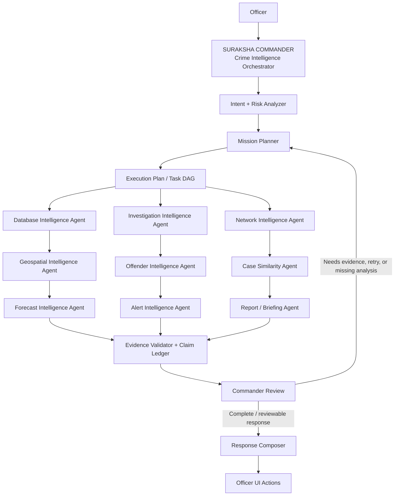
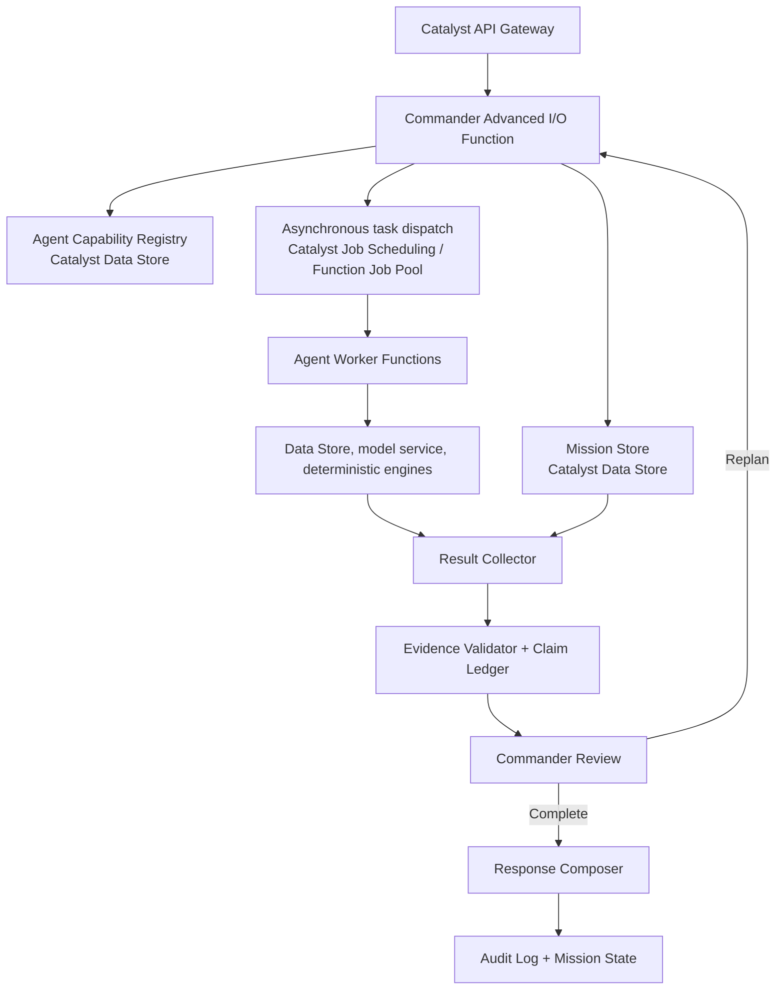

# Architecture Decisions and Delivery Roadmap

Last updated: 2026-07-15

This document records the target architecture and the complete phased implementation plan for SURAKSHA AI. It is a design decision record, not evidence that a feature is implemented. A phase may be marked `COMPLETE` only after its listed acceptance criteria have been tested.

## 1. Target intelligence architecture

SURAKSHA AI is a decision-support system. It does not autonomously take operational police action, declare guilt, or merge uncertain identities. Human officers review all intelligence products and decide all actions.



### 1.1 Commander control loop

`UNDERSTAND → PLAN → DELEGATE → OBSERVE → VALIDATE → CRITIQUE → REPLAN IF NECESSARY → COMPOSE RESPONSE → UPDATE MISSION STATE`

The Commander coordinates work; it does not directly execute SQL, calculate graph metrics, produce forecasts, enforce permissions, validate SQL, generate PDFs, or write audit records. Those are deterministic tools/services invoked by agents under policy controls.

### 1.2 Agent boundary

| Logical agent | Responsibility | Model role | Deterministic dependencies |
|---|---|---|---|
| Database Intelligence | Safe query planning and factual retrieval via structured tool calls | GLM (tool-calling mode, `tool_choice: "auto"`) | Schema registry (tool definitions → function schemas), ZCQL query builder (deterministic, converts tool params → valid ZCQL), row-scope injector, repository, Data Store |
| Investigation Intelligence | Investigation gaps, task prioritization, stopping recommendation | Qwen | Mission State, Claim Ledger |
| Entity Resolution | Candidate assessment without automatic merge | Qwen for difficult candidates | Normalization and similarity features |
| Network Intelligence | Link analysis and graph interpretation | GLM/Qwen explanation only | Graph projection and algorithms |
| Offender Intelligence | Candidate dossiers and priority explanations | GLM/Qwen | Scoring, identity policy |
| Geospatial Intelligence | Hotspots and geographic patterns | Explanation only | Coordinate checks and spatial algorithms |
| Trend Intelligence | Trends and anomalies | Explanation only | Aggregation and statistical tests |
| Forecast Intelligence | Forecast interpretation | GLM/Qwen interpretation only | Time-series model, baseline, backtest |
| Case Similarity | Candidate explanation/re-ranking | Qwen re-ranking only | Deterministic candidate retrieval/scoring |
| Alert Intelligence | Alert explanation and critical review | GLM/Qwen by severity | Deterministic rules and lifecycle |
| Lead Intelligence | Evidence-backed investigative hypotheses | Qwen | Claim/evidence policy |
| Report Intelligence | Briefings, dossiers, reports | GLM/Qwen narration | Provenance, PDF/file service |

### 1.3 Core contracts

The Commander may select only capabilities present in the Agent Capability Registry. Every task is a DAG node with `task_id`, `mission_id`, `agent_id`, `capability`, `objective`, `input_refs`, `dependencies`, `status`, `priority`, `timeout`, `retry_policy`, `permission_context`, and `result_ref`.

Every agent returns a standard result envelope containing its status, structured facts, computed findings, predictions, hypotheses, artifacts, evidence references, data-quality warnings, confidence semantics, suggested next tasks, and execution provenance.

Every visible statement is classified as one of:

- `DATABASE_FACT`
- `COMPUTED_FINDING`
- `MODEL_PREDICTION`
- `MODEL_HYPOTHESIS`

The Claim Ledger records each statement’s producer, evidence references, validation status, confidence semantics, and model/algorithm version. Unsupported claims cannot be rendered as facts.

### 1.4 Mission limits

| Limit | Value |
|---|---:|
| Maximum replans | 3 |
| Maximum agent calls per mission | 20 |
| Maximum concurrent agents | 5 |
| Initial end-to-end mission budget | 60 seconds, subject to verified Catalyst runtime/job limits |

## 2. Catalyst deployment mapping



| ID | Decision | Status | Rationale / consequence |
|---|---|---|---|
| ADR-001 | Use one Catalyst CLI project rooted at this repository. | PROPOSED | The root `catalyst.json` is the deployment manifest. Only verified `catalyst` CLI commands may be documented or run. |
| ADR-002 | Use `suraksha-dashboard/` as the canonical Phase 1 web client. | PROPOSED | It is the root manifest’s client source. The separate Next.js `frontend/` prototype remains preserved but is not a parallel deployment target. |
| ADR-003 | Use `functions/suraksha_ai/` as the canonical initial Advanced I/O function. | PROPOSED | It is declared in the root manifest. The competing `suraksha-api` implementation must not be deployed until an explicit consolidation decision. |
| ADR-004 | Implement the Commander as a coordinator plus registered worker capabilities. | ACCEPTED | It prevents a single model from acting as an unbounded autonomous worker and provides testable task boundaries. |
| ADR-005 | Persist Mission State, Task DAG, Agent Registry, Claim Ledger, Evidence References, and execution provenance in Data Store. | PROPOSED | This gives missions resumability, evidence provenance, and bounded context retrieval. Table design must be verified against Data Store capabilities before creation. |
| ADR-017 | GLM never generates raw ZCQL. Instead, GLM plans queries via structured **tool calls** with typed parameters (table, columns, filters, group by, order, limit). A deterministic executor validates the parameters against the schema allow-list and builds/runs the ZCQL. | ACCEPTED | Implemented in `tool_executor.py` and `chat_handler.py`. GLM receives `query_datastore` tool definition, returns structured calls, executor validates and builds valid ZCQL. Regex fallback in place. |
| ADR-018 | GLM tool definitions are the **sole source of truth** for what the model can do. Every capability exposed to the model must have a corresponding tool definition with a typed schema, description, and deterministic backend implementation. | ACCEPTED | Only `query_datastore` tool is exposed. New capabilities must add tool definitions before GLM can invoke them. |
| ADR-006 | Use Catalyst Job Scheduling/Function Job Pools for asynchronous worker dispatch unless a reviewed platform alternative is selected. | PROPOSED | Official Catalyst documentation supports Job Functions and job pools. The precise fan-out, retry, and callback design will be proven in a small spike before mission orchestration depends on it. |
| ADR-007 | Use Catalyst Circuits only for static, repeatable orchestration patterns; keep dynamic mission DAG scheduling in application code. | PROPOSED | Circuits orchestrate sequential/concurrent functions, but Commander-generated dynamic plans require application-controlled state and scheduling. |
| ADR-008 | Use Catalyst Authentication as the identity authority; do not mint application JWTs. | PROPOSED | Existing mock users and mock tokens cannot satisfy secure-access acceptance criteria. |
| ADR-009 | Enforce authorization in the application layer, with API Gateway authentication/routing as outer control. | PROPOSED | Permission, row scope, column restrictions, and PII masking must be deterministic and cannot trust client-supplied context. |
| ADR-010 | Use deterministic engines for queries, security, scoring, graphs, spatial analysis, forecasting, alerts, reports, and audit logs. | ACCEPTED | Models reason, plan, interpret, and compose; they do not execute or invent deterministic results. |
| ADR-011 | **UPDATED:** Use Catalyst QuickML GLM REST API directly (not the `zcatalyst_sdk` library) for all model calls — GLM chat, RAG, and tool-calling. | ACCEPTED | The `zcatalyst_sdk` QuickML wrapper is unreliable and undocumented for GLM. Verified endpoints: `POST /quickml/v1/project/{projectId}/glm/chat` (chat + tool calls) and `POST /quickml/v1/project/{projectId}/rag/answer` (RAG). Model: `crm-di-glm47b_30b_it`. Auth: `Zoho-oauthtoken` in `Authorization` header + `CATALYST-ORG` header. Supports `tools` array (typed function definitions), `tool_choice: "auto"`, and `chat_template_kwargs: { "enable_thinking": true }`. |
| ADR-012 | Treat existing relational SQL schemas as logical reference designs, not Catalyst migrations. | ACCEPTED | Catalyst Data Store setup, relations, and data import must use verified console/CLI procedures. |
| ADR-013 | Preserve existing user modifications during consolidation. | ACCEPTED | `STATUS.md` and `functions/suraksha_ai/common/chat/chat_handler.py` were already modified before this roadmap update. |

Official platform references: [Data Store](https://docs.catalyst.zoho.com/en/cloud-scale/help/data-store/introduction/), [Job Functions](https://docs.catalyst.zoho.com/en/serverless/help/functions/job-functions/), [Circuits](https://docs.catalyst.zoho.com/en/serverless/help/circuits/introduction/), [Advanced I/O](https://docs.catalyst.zoho.com/en/serverless/help/functions/advanced-io/), and [CLI deployment options](https://docs.catalyst.zoho.com/en/cli/v1/deploy-resources/deploy-options/).

### Verified GLM API

**Chat + tool-calling:**
`POST https://api.catalyst.zoho.in/quickml/v1/project/{projectId}/glm/chat`

**RAG:**
`POST https://api.catalyst.zoho.in/quickml/v1/project/{projectId}/rag/answer`

| Field | Value |
|---|---|
| Project ID | `55029000000013055` |
| Model | `crm-di-glm47b_30b_it` |
| Auth header | `Authorization: Zoho-oauthtoken <access-token>` |
| OAuth scope | `QuickML.rag.READ` |
| Org header | `CATALYST-ORG: 60076341598` |
| Content-Type | `application/json` |
| Tool calling | `tools` array with typed `function` schemas; `tool_choice: "auto"` |
| Streaming | `"stream": false` (default; streaming TBD) |
| Thinking | `"chat_template_kwargs": { "enable_thinking": true }` |

**Python reference:**
```python
import requests

url = "https://api.catalyst.zoho.in/quickml/v1/project/55029000000013055/glm/chat"
headers = {
    "Content-Type": "application/json",
    "Authorization": "Bearer YOUR_TOKEN",
    "CATALYST-ORG": "60076341598"
}
data = {
    "model": "crm-di-glm47b_30b_it",
    "messages": [
        {"role": "system", "content": "You are a helpful assistant."},
        {"role": "user", "content": "How many theft cases were registered in Bangalore?"}
    ],
    "max_tokens": 500,
    "temperature": 0.1,
    "stream": False,
    "chat_template_kwargs": {"enable_thinking": True},
    "tools": [
        {
            "type": "function",
            "function": {
                "name": "query_datastore",
                "description": "Query the Catalyst Data Store using ZCQL",
                "parameters": {
                    "type": "object",
                    "properties": {
                        "table": {"type": "string", "enum": ["CaseMaster", "CrimeSubHead", ...]},
                        "columns": {"type": "array", "items": {"type": "string"}},
                        "where": {"type": "array", "items": {...}}
                    },
                    "required": ["table", "columns"]
                }
            }
        }
    ],
    "tool_choice": "auto"
}
response = requests.post(url, json=data, headers=headers)
print(response.json())
```

**`zcatalyst_sdk` QuickML module is deprecated** — use the REST API directly as shown above. The SDK wrapper is unreliable for GLM tool-calling and lacks support for `tools`, `tool_choice`, and `chat_template_kwargs`.

**ZCQL constraints (the executor must enforce):**
- No `JOIN` — use two-step lookups or tool calls with sequential tool invocations
- No `LIKE` — use exact `=` matching
- No `COUNT(*)` — use `COUNT(ROWID)`
- No subqueries — use `IN (...)` with literal IDs from prior lookups
- No column aliases in `ORDER BY` / `HAVING`
- No `HAVING` clause
- No `UNION` / CTEs

## 3. Complete phased delivery plan

### Phase 0 — Repository audit

**Status:** COMPLETE (source audit only)

**Deliverables:** current-state audit, architecture decisions, known limitations, verified CLI/platform assumptions.

**Acceptance:** repository files inspected; unsupported claims and conflicts documented. This does not establish deployed-resource health.

### Phase 1 — Catalyst foundation

**Objective:** prove one secure, observable Catalyst vertical slice.

**Implement:** project/CLI verification; one canonical client/function target; authenticated `/api/v1/foundation/health`; request context; one non-sensitive `FoundationHealth` table; repository adapter; structured logs.

**Acceptance:** an authenticated browser request passes Gateway and function authorization, reads the live test table, returns its value, and produces structured logs. Test locally and in the Catalyst development environment.

### Phase 2 — Source database and schema registry

**Objective:** establish trusted FIR data access.

**Implement:** console-verified Data Store schema; safe CSV import; data-access repositories; schema metadata registry; data-quality checks; seed/demo dataset provenance.

**Acceptance:** authorized backend code retrieves FIR, accused, station, district, crime type, arrest, and legal-section data with documented data-quality warnings.

### Phase 3 — Security foundation

**Objective:** prevent unauthorized or excessive data access.

**Implement:** Catalyst Authentication integration; role mapping; request context; API authorization; row scope; column permissions; PII masking; persistent audit events; abuse/rate policy.

**Acceptance:** unauthorized users cannot obtain restricted records through direct APIs or model-assisted queries; tests cover role, row, column, and PII paths.

### Phase 4 — Database Intelligence vertical slice

**Objective:** provide evidence-backed natural-language data answers using GLM tool-calling.

**Implement:**

1. **Tool definitions** — Define `query_datastore` as a typed GLM tool function with parameters: `table` (enum of allowed tables), `columns` (array of allowed column names), `where` (array of `{column, operator, value}`), `group_by` (optional column), `order_by` (optional `{column, direction}`), `limit` (integer, capped at 1000). Each parameter has a description and type schema.
2. **GLM router** — Calls `POST /quickml/v1/project/{projectId}/glm/chat` with `tools: [query_datastore_def]`, `tool_choice: "auto"`, and the schema registry context in the system message. GLM returns a structured `tool_call` — not raw SQL.
3. **Deterministic executor** — Validates the tool call parameters against the table/column allow-list and row-scope policy. Builds valid ZCQL from the structured params. Executes via `execute_non_query`. Returns results (or error) to GLM for the follow-up response.
4. **Fallback** — If GLM doesn't call the tool (e.g., greeting), respond directly. If the tool call is invalid, return a clear validation error. If GLM is unavailable, the existing regex-pattern matcher (built in Phase 2) serves as the hard fallback.
5. **Schema registry** — Tool definitions are generated dynamically from the schema registry (table list, column list with types/descriptions) so the model knows what's queryable.
6. **UI** — Database Mode showing the generated ZCQL, tool call parameters, evidence references, and data-quality warnings.

**Acceptance:** an officer obtains a validated answer, the generated ZCQL, tool call parameters (visible), evidence references, and data-quality warnings. The model never directly accesses Data Store — it produces tool calls that the deterministic executor runs. The fallback pattern matcher still works if the model is unreachable.

**Note:** Phase 2's regex-pattern matcher (`chat_handler.py`) remains the active runtime query planner until this phase is implemented and tested. Phase 4 replaces it.

### Phase 5 — AI governance foundation

**Objective:** make every AI and analytical action traceable.

**Implement:** Model Registry; Prompt Registry; Agent Capability Registry; agent result envelope; Agent Execution; Mission; Mission Task; Mission State; Claim Ledger; Evidence Reference contracts and persistence.

**Acceptance:** every model call, deterministic query, claim, artifact, and evidence reference can be traced by IDs and versions.

### Phase 6 — Commander vertical slice

**Objective:** demonstrate a controlled multi-agent investigation.

**Implement:** intent/risk analyzer; Commander; mission planner; dynamic task DAG; bounded dispatcher; shared state; result collector; Evidence Validator; Commander Review; replan limits. Start with Database, Trend, and Geospatial agents.

**Acceptance:** a complex request creates a mission, executes independent tasks concurrently where safe, validates results, optionally replans, and returns an evidence-backed assessment.

### Phase 7 — Command Center

**Objective:** create the primary operational intelligence interface.

**Implement:** Karnataka map; KPI cards backed only by data; timeline; Intelligence Stream; Intelligence Drawer; permission/data-quality/loading states; mission progress.

**Acceptance:** the landing view tells a coherent, evidence-linked intelligence story without fabricated fallback metrics.

### Phase 8 — Entity resolution and Offender Pool

**Objective:** support cross-FIR candidate analysis without claiming uncertain identity matches as fact.

**Implement:** normalization; deterministic candidate generation; feature extraction; reviewable Qwen reasoning; identity classifications; `ResolvedPersonCandidate`; `PersonIdentityLink`; priority snapshots; Offender Pool and dossier UI.

**Acceptance:** cross-FIR candidate links expose confidence, supporting/contradicting evidence, and human-review status; no automatic merges occur.

### Phase 9 — Network intelligence

**Objective:** provide explainable criminal-link analysis.

**Implement:** co-accused edge data; graph projection; deterministic algorithms; graph APIs; visualization; edge evidence; GLM request interpretation and Qwen deep interpretation only.

**Acceptance:** users can inspect a candidate network and see evidence for every material relationship and computed graph measure.

### Phase 10 — Case similarity

**Objective:** identify reviewable similar FIRs.

**Implement:** feature extraction; fact representation; deterministic retrieval; hybrid scoring; Qwen re-ranking; difference/explanation rendering.

**Acceptance:** a selected FIR returns evidence-backed similar cases, including why each case is similar and where the evidence differs.

### Phase 11 — Forecasting

**Objective:** generate reproducible, measured forecasts.

**Implement:** time-series construction; temporal train/test split; walk-forward validation; naïve baseline; metrics; Forecast Run/Result persistence; drift/model-health monitoring; scheduled refresh through verified Catalyst job facilities.

**Acceptance:** displayed values originate only from versioned Forecast Results, beat or disclose comparison with the baseline, and never come from an LLM.

### Phase 12 — Alert engine

**Objective:** deliver officer-controlled, explainable early warnings.

**Implement:** deterministic anomaly, hotspot, forecast, repeat-activity, network-expansion, cross-district, and data-quality rules; severity/confidence policy; alert lifecycle; explanation layer; critical review path.

**Acceptance:** every alert contains its trigger, observed value, baseline, affected scope, evidence, model/algorithm version, and officer-controlled status.

### Phase 13 — Investigation workspace

**Objective:** persist an officer’s evidence-backed investigation.

**Implement:** Investigation, items, notes, pinned intelligence, saved queries/graphs, alerts, leads, mission history, Claim Ledger view, contradictions, permissions.

**Acceptance:** authorized officers can collect intelligence artifacts into a persistent workspace while preserving provenance and uncertainty.

### Phase 14 — Lead engine and consensus

**Objective:** present hypotheses safely.

**Implement:** Qwen lead generation; mandatory supporting and contradicting evidence; GLM critic for high-risk outputs; consensus/review states; human decision workflow.

**Acceptance:** leads never appear as established facts, and unresolved model disagreement is visible to the officer.

### Phase 15 — Briefings and reports

**Objective:** produce shareable, attributable intelligence products.

**Implement:** briefing mode; investigation report; offender dossier; alert/network brief; verified Catalyst-compatible PDF/file workflow; provenance and limitations appendix; authorization checks.

**Acceptance:** authorized officers can generate a professional report containing evidence, limitations, model/algorithm versions, and analytical provenance.

### Phase 16 — Polish, evaluation, and demo

**Objective:** prepare a reliable hackathon demonstration.

**Implement:** command bar; generative response rendering; progress/loading states; dashboard/graph/map transitions; deterministic demo data; demo script; performance hardening; evaluation harness; security and end-to-end tests.

**Acceptance:** a rehearsed demo completes the end-to-end investigation narrative, with controlled fallbacks and documented evidence for every intelligence output.

## 4. Dependencies and sequencing

| Capability | Earliest phase | Cannot proceed without |
|---|---:|---|
| Any protected officer request | 1–3 | Verified Catalyst project/function/client, Authentication, request context |
| Trustworthy case retrieval | 2 | Data Store schema, import, repositories, data-quality checks |
| AI-assisted database questions | 4 | Security foundation, schema registry, verified GLM tool-calling API contract (ADR-017) |
| Persistent mission orchestration | 5–6 | State/claim contracts, task dispatch spike, worker result envelope |
| Entity/network/offender intelligence | 8–9 | Source data, identity policy, evidence model |
| Forecasts and alerts | 11–12 | Sufficient time series, backtesting, scheduled jobs |
| Leads and reports | 14–15 | Claim Ledger, evidence validation, permissions, artifact storage |

## 5. Non-negotiable quality gates

- No feature is `COMPLETE` without its acceptance test.
- No model may directly execute a database query or deterministic calculation.
- No model hypothesis may be rendered as a database fact.
- No identity candidate may be merged automatically.
- No protected API may trust client-supplied role, scope, or user identity.
- No production Catalyst deployment occurs without completing development-environment verification and console promotion review.
