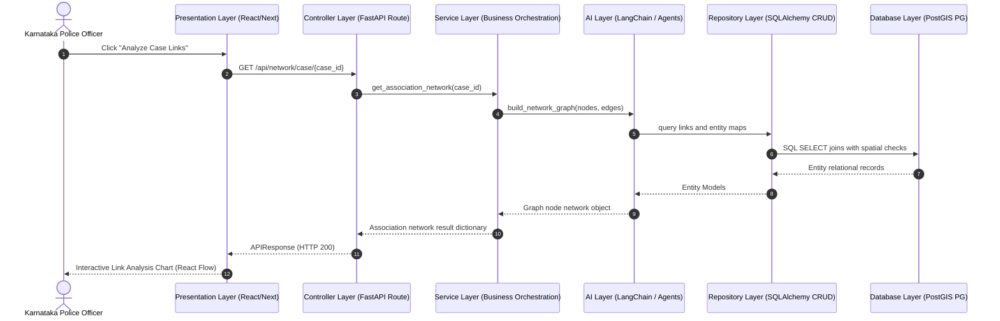

# UML Sequence Diagram

The sequence below illustrates a standard case intelligence analysis request:

```mermaid
sequenceDiagram
    autonumber
    actor Officer as Karnataka Police Officer
    participant Presentation as Presentation Layer (React/Next)
    participant Controller as Controller Layer (FastAPI Route)
    participant Service as Service Layer (Business Orchestration)
    participant AI as AI Layer (LangChain / Agents)
    participant Repository as Repository Layer (SQLAlchemy CRUD)
    participant Database as Database Layer (PostGIS PG)

    Officer->>Presentation: Click "Analyze Case Links"
    Presentation->>Controller: GET /api/network/case/{case_id}
    Controller->>Service: get_association_network(case_id)
    Service->>AI: build_network_graph(nodes, edges)
    AI->>Repository: query links and entity maps
    Repository->>Database: SQL SELECT joins with spatial checks
    Database-->>Repository: Entity relational records
    Repository-->>AI: Entity Models
    AI-->>Service: Graph node network object
    Service-->>Controller: Association network result dictionary
    Controller-->>Presentation: APIResponse (HTTP 200)
    Presentation-->>Officer: Interactive Link Analysis Chart (React Flow)
```
